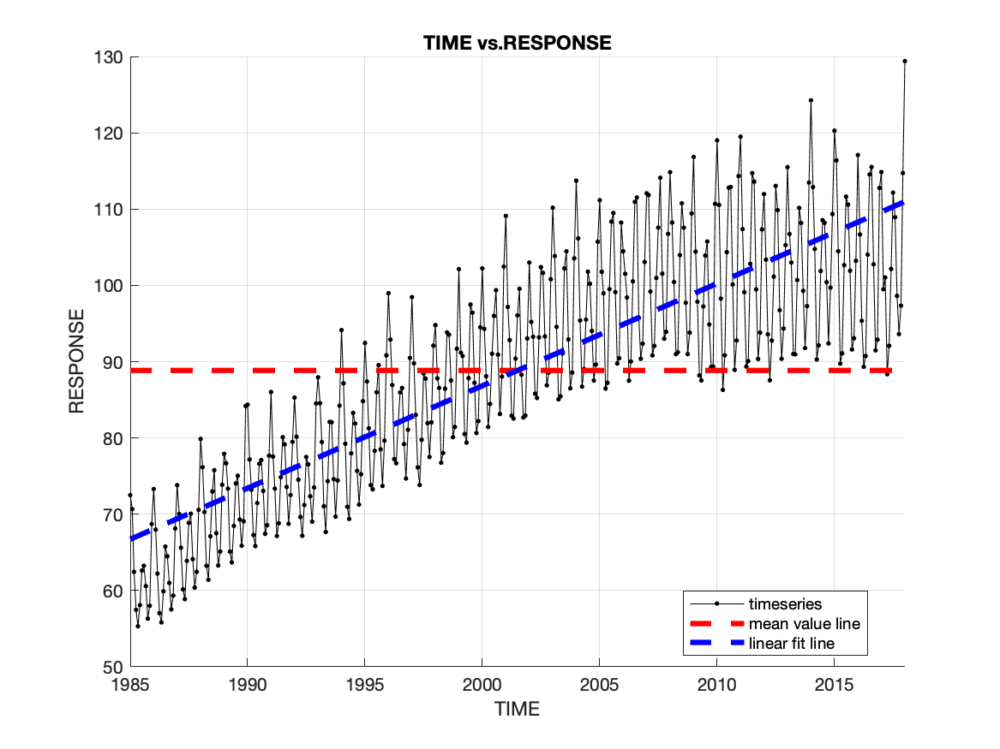

# SAMPLE MATLAB CODE

Sample Matlab code to load a timeseries from local CSV file, plot it, and save to PNG.

_This project is a MATLAB coding test as part of an interview for Mitek, 
written in Matlab 2024a._  

```
 A.  Produce documented Matlab code that does the following.
 Reads datasets consisting of two csv files
  - File 1, data file
	has two columns: date, value
  - File 2, config file
	has three columns: key,value,comment 
	specifies the following features of the output plot
    	   Mean value line show or not 
    	   Linear data fit line show or not 
	   xlabel
           ylabel  
 The code writes PNG plot file showing
  - data
  - fit lines, as specified in the config file
  - line legends
  - xlabel ylabel 
  - title: ylabel vs xlabel
 Documentation
   - Code has built in documentation, heavy comments  
 Three test datasets should be included

B. Produce GitHub page with 
 - project description
 - functionality description
 - user instructions  
 - data interface specs
 - explanation of the results in the generated PNG

C. Test response time will be evaluated
``` 

--- 
### User Instructions  

1. Clone the repo in some desired location: 

```commandline
git clone git@github.com:shb84/mitek.git
```

2. Open MATLAB and navigate to `path/to/mitek/scripts` 
3. Run `main.m` from the Matlab commandline 
4. Edit user inputs as needed: 

```commandline
%% --- USER INPUTS ---
DATA_FILE = '../data/Electric_Production.csv'; % https://www.kaggle.com/datasets/shenba/time-series-datasets
CONFIG_FILE = 'Config.csv'; % % Change Value colum in file as needed
```

> Note: There are three sample datasets in `mitek/data` to choose from. All output PNG plots saved locally.

---
### Explanation Of Results

The sample datasets were all taken from Kaggle and are plotted below. Hyperlinks are provided in the titles. The time
series is shown as a solid black line, the mean value line as a dashed red line, and a reference linear trend line is 
shown as a blue dashed line. There is nothing particularly noteworthy about these examples; they are just test data.  

<div align="center">

|   Example #1: [Electric Production](https://www.kaggle.com/datasets/shenba/time-series-datasets)    |  Example #2: [Month Value](https://www.kaggle.com/datasets/podsyp/time-series-starter-dataset)   | Example #3: [POP](https://www.kaggle.com/datasets/census/population-time-series-data)  |
|:------------------------------------:|:------------------------------:|:--------------------:|
|  |  |  |

</div>

--- 
### License
Distributed under the terms of the MIT License.


